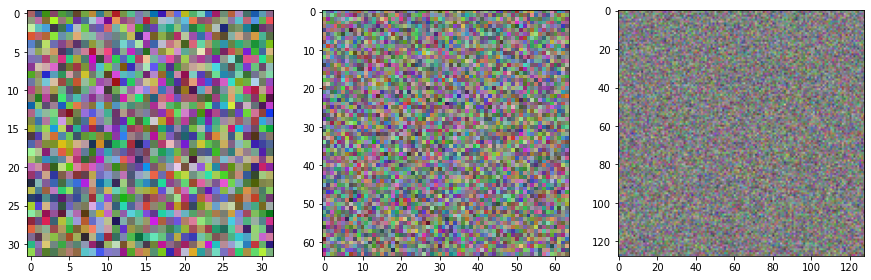
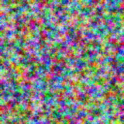
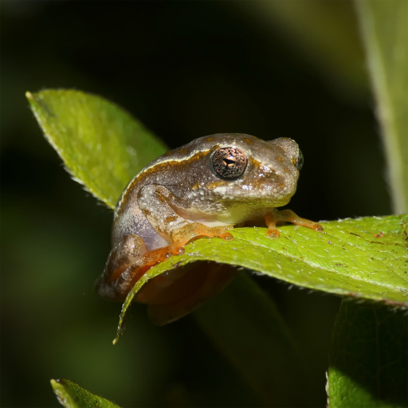
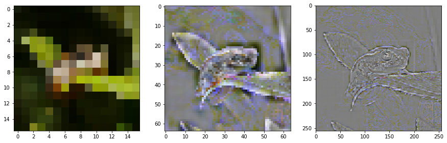
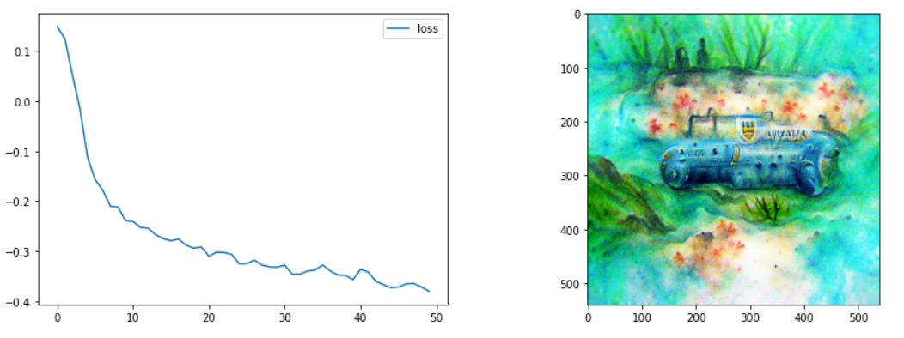
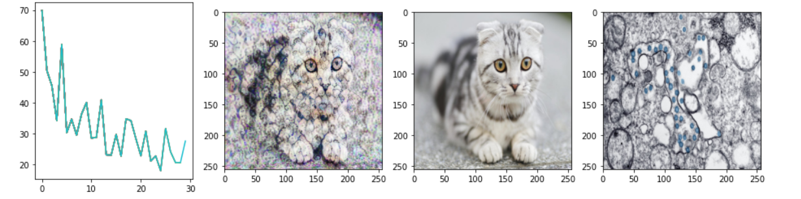

ImStack
================

<!-- WARNING: THIS FILE WAS AUTOGENERATED! DO NOT EDIT! -->

Optimizing the pixel values of an image to minimize some loss is common
in some applications like style transfer. But because a change to any
one pixel doesn’t affect much of the image, results are often noisy and
slow. By representing an image as a stack of layers at different
resolutions, we get parameters that affect a large part of the image
(low-res layers) as well as some that can encode fine detail (the
high-res layers). There are better ways to do this, but I found myself
using this approach enough that I decided to turn it into a proper
library.

Here’s a [colab
notebook](https://colab.research.google.com/drive/10gSIlqRGom18kl8NZSytyWYciej8H46N?usp=sharing)
showing this in action, generating images to match a CLIP prompt.

## Install

This package is available on pypi so install should be as easy as:

`pip install imstack`

## How to use

We create a new image stack like so:

``` python
ims = ImStack(n_layers=3)
```

By default, the first layer is 32x32 pixels and each subsequent layer is
2x larger. We can visualize the layers with:

``` python
ims.plot_layers()
```



The parameters (pixels) of the layers are set to requires_grad=True, so
you can pass the layers to an optimizer with something like
`optimizer = optim.Adam(ims.layers, lr=0.1, weight_decay=1e-4)` to
modify them based on some loss. Calling the forward pass
(`image = ims()`) returns a tensor representation of the combined image,
suitable for various pytorch operations.

For convenience, you can also get a PIL Image for easy viewing with:

``` python
ims.to_pil()
```



### Loading images into an ImStack

You don’t need to start from scratch - pass in a PIL image or a filename
and the ImStack will be initialized such that the layers combine to
re-create the input image as closely as possible.

``` python
from PIL import Image

# Load the input image
input_image = Image.open('demo_image.png')
input_image
```



Note how the lower layers capture broad shapes while the final layer is
mostly fine detail.

``` python
# Create an image stack with init_image=input_image and plot the layers
ims_w_init = ImStack(n_layers=3, base_size=16, scale=4, out_size=256, init_image=input_image)
ims_w_init.plot_layers()
```



# Examples

### Text-to-image with ImStack+CLIP

Very fast text-to-image, using CLIP to calculate a loss that measures
how well the image matches a text prompt. In this example, the prompt
was ‘A watercolor painting of an underwater submarine’:

``` python
Image.open('clip_eg.png')
```



[colab
link](https://colab.research.google.com/drive/10gSIlqRGom18kl8NZSytyWYciej8H46N?usp=sharing)

[and a CLOOB
version](https://colab.research.google.com/drive/1PAPb2PiGHxnPwF2JaYKFnE063vXJPRfu?usp=sharing)

### Style Transfer

Simple style transfer, with an ImStack being optimized such that content
loss to one image and style loss to another are minimized.

``` python
Image.open('style_tf_eg.png')
```



[colab
link](https://colab.research.google.com/drive/1Zh3OxXE0OWqwzrAhvUBX2VtRBgz87ahQ?usp=sharing)
