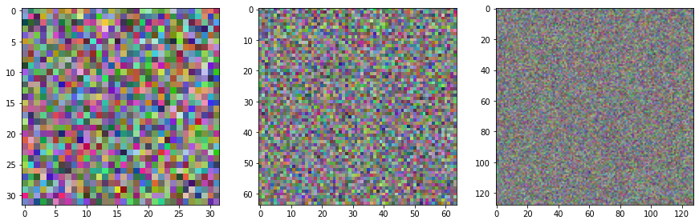

# Project name here
> Summary description here.


This file will become your README and also the index of your documentation.

## Install

`pip install imstack`

## How to use

Fill me in please! Don't forget code examples:

```python
1+1
```


    2


```python
ims = ImStack(n_layers=3)
ims.plot_layers()
```


    

    


```python
from nbdev.export import notebook2script; notebook2script() # Export via nbdev
```

    Converted 00_core.ipynb.
    Converted index.ipynb.

